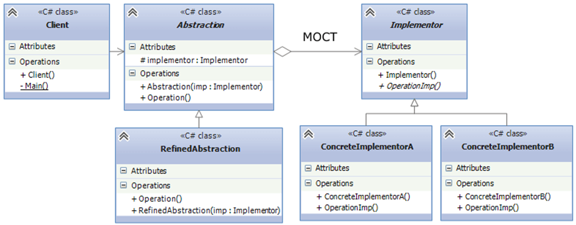
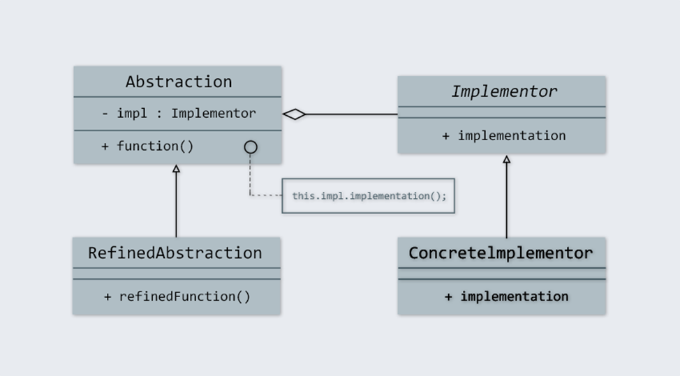

# STP_PatternBridge
_Created for the course "Stack of programming technologies" V. N. Karazin Kharkiv National University_

Ruby 3.3.5 Pattern Bridge.
___

# Паттерн Міст

Паттерн "Міст" (Bridge) – це структурний шаблон проектування (тобто його основне завдання — створення повноцінної структури із класів та об'єктів), основна мета якого полягає в тому, щоб відокремити абстракцію від її реалізації. Це дозволяє змінювати як абстракцію, так і реалізацію незалежно одну від одної, що робить систему більш гнучкою і розширюваною.

# Ідея паттерна

Ключова ідея паттерна полягає в тому, щоб створити дві окремі ієрархії:

1. Абстракція – представляє інтерфейс для користувача або основну функціональність.
2. Реалізація – конкретний механізм, що виконує реальну роботу. Абстракція містить посилання на реалізацію.

Завдяки цьому підходу, будь-які зміни в одній ієрархії не впливають на іншу. Це забезпечує можливість додавання нових реалізацій або абстракцій без зміни існуючого коду.

# Застосування паттерна Bridge

Паттерн Bridge корисний у випадках, коли є потреба:

- Працювати з різними платформами (наприклад, підтримка декількох операційних систем).
- Використовувати різні бази даних або інші джерела даних (SQL, NoSQL).
- Інтегруватися з різними API (наприклад, хмарні сервіси, соціальні мережі).

Паттерн також застосовується тоді, коли потрібно уникнути жорсткої прив’язки абстракції до її реалізації, або коли абстракцію і реалізацію необхідно змінювати незалежно одну від одної.

# Структура паттерна Bridge

1. Абстракція (Abstraction) – основний інтерфейс або клас, що представляє логіку на високому рівні. Вона містить посилання на об'єкт реалізації (Implementor).
2. Реалізація (Implementor) – інтерфейс або базовий клас для реалізацій.
3. Конкретна абстракція (Refined Abstraction) – розширений клас абстракції, що додає додаткову функціональність.
4. Конкретна реалізація (Concrete Implementor) – клас, що конкретно реалізує методи реалізації.




Зв’язок агрегації між класами Abstraction та Implementor фактично і представляє деякий міст між двома паралельними ієрархіями класів. Саме тому патерн отримав назву Міст.

# Приклад реалізації паттерна Bridge на мові Ruby

Створимо простий приклад реалізації паттерна на прикладі автомобілів:
- В якості реалізації буде загальний клас автомобіля `Car`. 
- В якості конкретної реалізації будуть види автомобілів `Mercedes`, `BMW`, `Volkswagen`.
- В якості абстракції буде загальний клас кольору автомобіля `CarColor`.
- В якості конкретної абстракції будуть види кольорів автомобілів `Red`, `Blue`, `Yellow`.
- Кожне авто матиме метод `Info` який виводить інформацію про неї (тип авто, колір швидкість).
- Реалізація та абстракція поєднуються завдяки полю `@_color` в класі реалізації `Car`, що є нашим "містом" між ієрархіями.
- Така реалізація паттерну `Bridge` в структурі нашої програми дозволяє нам створювати безліч класів типів авто та додавати безліч класів видів кольору, при цьому ці зміни не будуть впливати один на одного (є незалежними).

```ruby
redMercedes = Mercedes.new(Red.new, 160)
blueVolkswagen = Volkswagen.new(Blue.new, 150)
yellowBMW = BMW.new(Yellow.new, 170)

puts redMercedes.Info 
# Виведе: "Це Mercedes кольору Red, максимальна швидкість 160 км/год"
puts blueVolkswagen.Info 
# Виведе: "Це Volkswagen кольору Blue, максимальна швидкість 150 км/год"
puts yellowBMW.Info 
# Виведе: "Це BMW кольору Yellow, максимальна швидкість 170 км/год"
```

# Переваги паттерна Bridge:

1. **Незалежність абстракції та реалізації** – Легко додавати нові реалізації або абстракції без змін у наявних класах.
2. **Гнучкість** – Можна вільно комбінувати різні абстракції з різними реалізаціями.
3. **Зменшення дублювання коду** – Одна і та ж логіка може використовуватися в різних контекстах.

# Ознаки застосування паттерна:

- Чітко виражене розділення між класами, що відповідають за управління і виконання, коли керуючі об'єкти делегують функції виконання іншим класам (реалізаціям).

# Висновки

Паттерн "Міст" (Bridge) дозволяє відокремити абстракцію від реалізації, що робить систему більш гнучкою і легко розширюваною. Його використання доцільне, коли потрібно забезпечити незалежну змінюваність двох або більше ієрархій класів — наприклад, коли є кілька варіантів реалізації або різні аспекти функціональності. Це зменшує зв'язність коду та запобігає дублюванню, оскільки кожна ієрархія може розвиватися окремо. Такий підхід особливо корисний при роботі з різними платформами, типами пристроїв чи API, командній розробці, забезпечуючи легку інтеграцію нових компонентів без порушення існуючої архітектури.